# Custom NPC Dialog

A custom dialog system which can be used to talk to any NPC created in an experience.
Dialog systems in video games are very common place today. We need to be able to talk to other characters in our worlds, after all!

> Author: Bradyn Glines (@glinesbdev)

## Creating the new device

Open an existing or new project inside of UEFN. To create the custom device within your proejct, you need to open the Verse explorer.

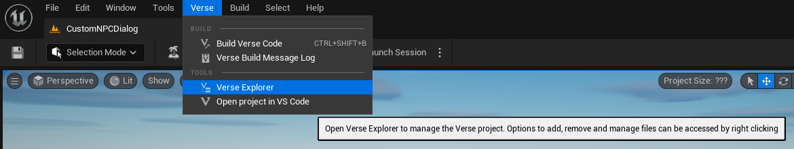

This will open another window, which you can choose to dock anywhere in the interface.

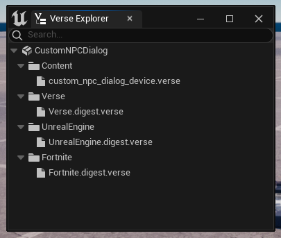

Inside the Verse Explorer, right click on the `Content` folder and choose `Create New Verse File`.

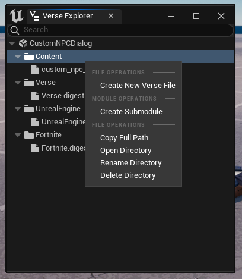

After clicking the `Create New Verse File` button, you will be presented with another window to create the file. The name of this script for this example is `custom_npc_dialog_device`. Then click the `Create` button to close the dialog window.

> Although you don't need to use the suffix `_device` for custom device scripts, it's good practice and makes it clear what this script is for.

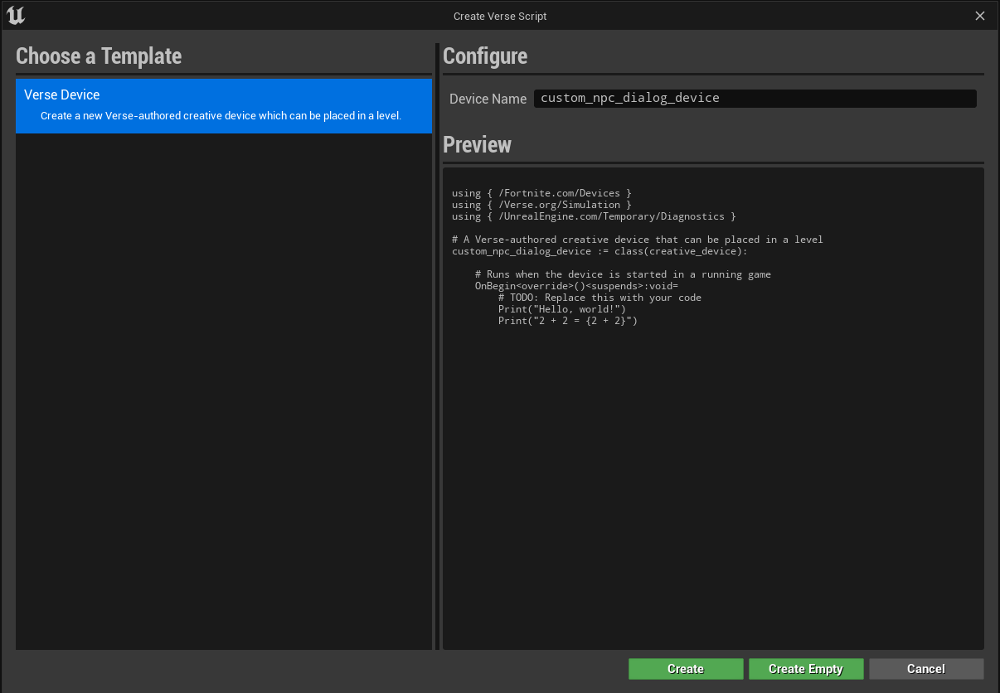

UEFN automatically creates a VS Code workspace when you open it which means you will need to have VS Code installed on your computer to edit the script.

[Download VS Code](https://code.visualstudio.com/download)

Once you have VS Code installed on your computer, you can click the `Verse` button in the UEFN toolbar to open up your project in VS Code.
We will come back to the VS Code editor after setting up the other devices we will use in our script soon. For now, we will return to the UEFN editor.

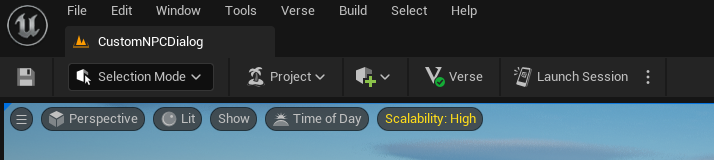

To be able to interact with your new device, you will need to compile the Verse script in your project. You can do that either by using the keyboard shortcut `CTRL+SHIFT+B` or /home/bradyn/projects/versus/src/examples/custom_npc_dialog/imagesby clicking the `Build Verse Code` button in the `Verse` window menu.

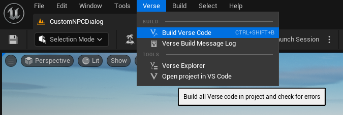

Once the code is built, you can find your new device in the `Content Browser` at the bottom of the UEFN editor. The filepath where it is stored is `All -> YourProjectName -> CreativeDevices`. Drag the new device into the viewport.

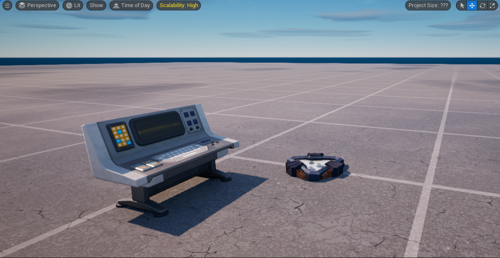

If you don't want the device visible in the game when it's played, you can hide it by unchecking `Visible in Game` in the Details panel. If you don't see that in the details panel, click on the device in the viewport first. Make sure to keep `Enabled at Game Start` checked!

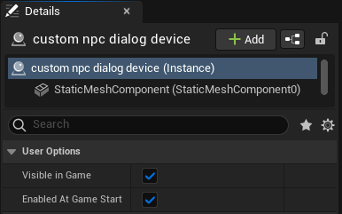

## Devices setup

### Popup Dialog Device

To show the dialog on the screen to the player, we will use the the `Popup Dialog Device`. This can be found in the `Content Browser` under the `All -> Fortnite -> Devices` folder. Drag this device into the viewport.

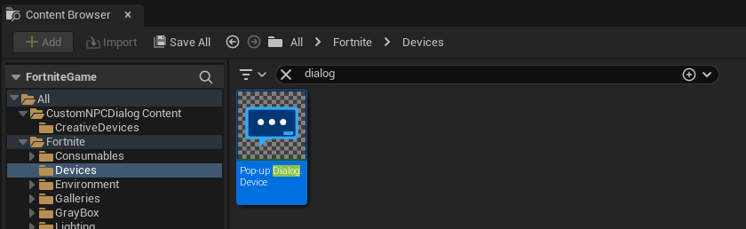

> Note that this device doesn't have a mesh assigned to it so it will appear invisible. If it becomes de-selected while you're working on it, you can select the device from the Outliner.

We will now need to change some of the settings for the `Popup Dialog Device`. In the details panel, make the following changes:

- Content Alignment: Bottom Wide
- Button 1 Text: Next
- Button 2 Text: Leave

> These buttons can say anything that you choose. We will not set the `Title` or the `Description` fields of this device as they will be changed in code.

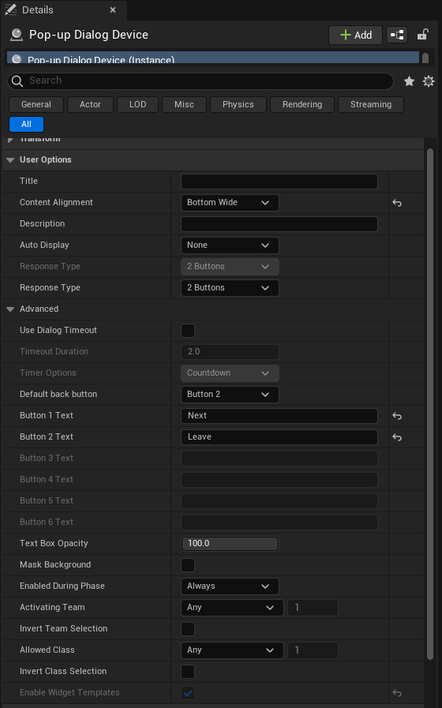

### Trigger Device

To trigger an event that we can interact with in Verse code when the player clicks a button, we will use the Trigger device.

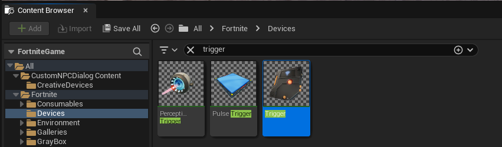

The only change we need to make to this device is the `Trigger` function and what happens when it's triggered. Click the `+` button next to `Trigger` function and choose the `Pop-up Dialog Device` from the first dropdown list and `On Responding Button 1` from the second dropdown.

> `Pop-up Dialog Device` in the first dropdown is the name of my device in my game. If you've renamed the Popup Dialog Device in the Outliner then you would choose that option.

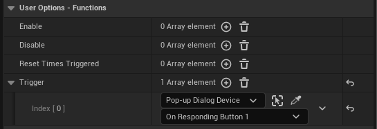

### Character Device

We will use the `Character Device` as the NPC the player will talk with in the game. Select the `Character Device` in the `Content Browser` and drag it into the viewport.

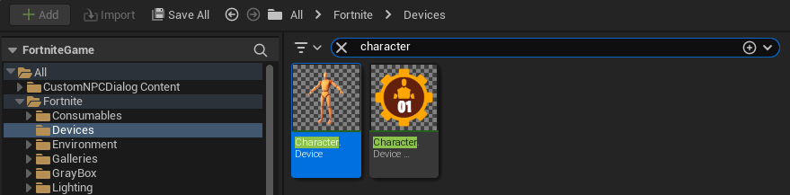

The setting changes we will make for this device are:

- Use Animated Idle: Checked (Not required, just for fun)
- Interact Type: Send Event Only (Required! Won't work without this!)

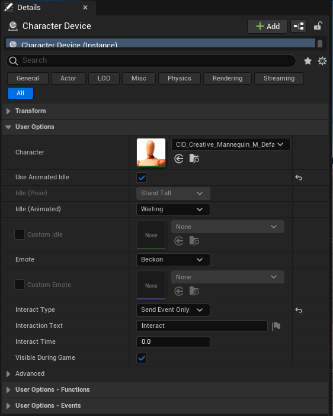

### Custom NPC Device

Finally, we need to write the code for our Custom NPC Device we created earlier. Here is the code in it's entirety. It's heavliy commented to explain exactly what is happening at each step of the process.

```ruby
### custom_npc_dialog_device.verse

# External references provided by Epic Games; available in all UEFN experiences.
using { /Fortnite.com/Devices }
using { /UnrealEngine.com/Temporary/UI }
using { /Verse.org/Simulation }

## Helpers

# A method that takes in a `string` and gives back a `message`.
#
# Insight: The `<localizes>` specifier turns a string ("like this, surrounded in double quotes") into a translatable
#          `string` that UEFN uses to show text to the player. The `message` data type requires the `<localizes>` specifier.
#          All text shown to the player must be localized. When a string is used inside curly braces `"{Text}"`,
#          it takes the variable and inserts it into the string at that place. This can be used with other data types
#          as well like `int`, `logic`, etc.
#
#          This method is also `<public>` so that we could use it anywhere in our project.
#          Generic helper methods like these are the most useful when you can use them whenever you need them.
LocalizeText<public><localizes>(Text : string) : message = "{Text}"

## Custom NPC Dialog Device

# The custom device definition. When creating new devices, you must make a class that inherits from `creative_device`.
# By using this inheritance structure, the new device is able to be put into the game world in UEFN.
custom_npc_dialog_device := class(creative_device):
    ## Properties

    # All of the properties of this class will be marked as `<private>`. This is because they will only be used in this class.
    # This also makes sure that no other class in our project can read these properties.
    #
    # Insight: It's good, and almost expected, code practice to have all of your setup code for a class at the top,
    #          before all of the behavior methods are defined.
    #
    # This is the NPC character that we will be speaking to.
    # The `character_device` allows us to import a skin from the Fortnite catalog with interaction capabilities
    # already built in!
    #
    # Insight: The `@editable` here makes our variable configurable in the UEFN editor when editing our custom device!
    @editable
    NPC<private> : character_device = character_device{}

    # This is our trigger device. We will use this to detect when the player clicks the `Next` button in the dialog window.
    @editable
    NextDialogTrigger<private> : trigger_device = trigger_device{}

    # This is our dialog device which pops up a dialog window to the player. We will be using a 2 button configuration
    # for our device. We will also show the following additional information:
    #
    # * Title - What shows up at the top of the dialog popup.
    # * Description - The main text that the player will read on our dialog popup.
    # * Button1 - The button that will progress the dialog with the NPC. This will say "Next".
    # * Button2 - The button that will end the dialog at any point the player clicks on it. This will say "Leave".
    @editable
    PopupDialog<private> : popup_dialog_device = popup_dialog_device{}

    ## Dialog system settings

    # This is the name of the NPC that we will show to the player.
    # This NPC's name will not change throughout the duration of the conversation.
    NPCName<private><localizes> : message = "Mannequin"

    # This is the set of dialog messages that we will show to the player.
    # This will change what the player sees as we click the "Next" button in the popup dialog.
    # These lines of dialog can be anything you choose them to be. The only requirement is that they have to be
    # surrounded by double quotes, "like this", followed by a comma `,` (except for the last item).
    NPCDialogMessages<private> : []string = array:
        "Wow, isn't this neat?",
        "We're having a conversation.",
        "But we both know that I'm the only one talking.",
        "It feels kind of one sided, doesn't it?"

    # This variable will keep track of the current message that we are displaying to the player.
    var MessageIndex : int = 0

    ## Methods

    # The `OnBegin` method is required to be overriden by a `custom_device` class, like this one. This methods perfoms
    # all of the actions defined within the method body when the game starts, provided that your device is enabled
    # during gameplay.
    #
    # Insight: The `suspends` attribute means that the code within this method's body (everything after the `=`) runs
    #          in an asynchronous context which means it runs in the background (usually another thread) so it doesn't block
    #          other code from running. This context is useful when you have some code that needs to complete, but it doesn't
    #          need to complete at that moment in time and it doesn't matter when it finishes. Since this is a class method for a
    #          `custom_device`, UEFN takes care of activating (called `calling` in programming) it for you and
    #          will be ready to be used when your game starts.
    OnBegin<override>()<suspends> : void =
        # First we will set the popup dialog title (shown at the top of the dialog popup).
        PopupDialog.SetTitleText(NPCName)

        # Next, we will listen for the event when the player speaks to the NPC.
        #
        # Insight: When using `Subscribe` methods on events, we give it another method that we define, but, notice that we don't
        #          activate (call) the method ourselves. UEFN will call this method for us whenever the NPC is interacted with.
        NPC.InteractedWithEvent.Subscribe(OnNPCInteracted)

        # Finally, we will listen for the event when the player clicks the "Next" button in the dialog popup.
        NextDialogTrigger.TriggeredEvent.Subscribe(OnNextButtonClicked)

    # Deterimine what to do when the player interacts with the NPC.
    # The signature of this method (what arguments it takes in, between the paratheses) is (Agent : agent).
    # An `agent` is a data type that is used to get an in-game player who interacted with this NPC.
    #
    # Insight: These event method names can be anything that you want. A very common practice, however, is to start the
    #          method name with `On` followed by the noun the action is happening to, `NPC`, and the verb that happens
    #          to it in the past tense, `Interaction`.
    OnNPCInteracted<private>(Agent : agent) : void =
        # We get the first message which will be shown to the player. We need to check this with an `if` statement because
        # array indexing can fail!
        if (Message := NPCDialogMessages[0]):
            # We change the popup's current description text to what the NPC is saying. We use our `LocalizeText`
            # method to change the `string` into a `message` so that it can be displayed to the player.
            # Remember that Verse arrays start at index 0, not 1!
            PopupDialog.SetDescriptionText(LocalizeText(Message))

            # We increase the `MessageIndex` by 1. We do this so that when the "Next" button is clicked,
            # we show the next message in the list.
            set MessageIndex += 1

            # Show the dialog popup to the player who talked to the NPC.
            PopupDialog.Show(Agent)

    # Determine what to do when the player clicks the "Next" button in the dialog popup.
    # The signature of this method is (Agent : ?agent).
    # When you see a `?` in front of any type, it means it could either:
    # * Be the type after the `?`, `agent`, in this case, or
    # * It could be a `false` or `null` value (meaning it has no value)
    OnNextButtonClicked<private>(Agent : ?agent) : void =
        # Since the Agent in this method can be either an `agent` or nothing, we need to make sure we can get the
        # human player's `player` object. If we didn't do this check, we couldn't show the dialog popup to the player
        # since we wouldn't have a player to show it to!
        #
        # Insight: Since were dealing with a type of `?agent`, we need to ask if the `agent` has a value. We do that in
        #          verse by putting a `?` after the parameter name: `Agent?`. We do that check while casting the `Agent`
        #          to a `player` type. Casting means taking one data type and attempting to change it to another.
        #          In this case, we're attempting to change the `agent` type to a `player` type.
        if (Player := player[Agent?]):
            # We need to determine which message to show to the player.
            if:
                # This will get the message at the current `MessageIndex` (the nth message in the lsit).
                Message := NPCDialogMessages[MessageIndex]

                # After get the message, we will increase the `MessageIndex` by 1. We do this so that the next time
                # the "Next" button is clicked, we show the next message in the list.
                set MessageIndex += 1

                # We want to make sure that we aren't trying to get more messages than the NPC will actually say.
                # If this check wasn't here, the game would either give you an error in the log or could crash!
                MessageIndex <= NPCDialogMessages.Length
            then:
                # We change the popup's current description text to what the NPC is saying. We use our `LocalizeText`
                # method to change the `string` into a `message` so that it can be displayed to the player.
                PopupDialog.SetDescriptionText(LocalizeText(Message))

                # We have to re-show the dialog popup to the player who interacted with the NPC. Otherwise, the dialog popup would close.
                PopupDialog.Show(Player)
            # If any of the conditions in the above `if` block return a false value then we will hide (remove) the dialog
            # from the players screen. We also set the `MessageIndex` back to 0 so that the conversation will reset
            # the next time we talk to this NPC.
            else:
                set MessageIndex = 0
                PopupDialog.Hide(Player)
```

Once you have the code saved and re-compiled in the UEFN edtior, some new options show up in your device's `Details` panel.

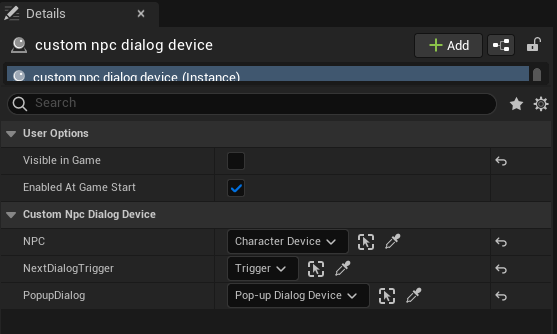

Now it's time to wire up the other devices used in the script into this device. Choose the appropriate options for `NPC` (character device), `NextDialogTrigger` (trigger device), and `PopupDialog` (pop-up dialog device).

## Conclusion

That's it! Play your game and interact with the NPC. You'll see that they will say the same messages that we configured in our script! By clicking the `Next` button, you'll see that the text that the NPC says changes.

Thanks for taking the time to read this and I hope that it helps you take your games further with UEFN!
